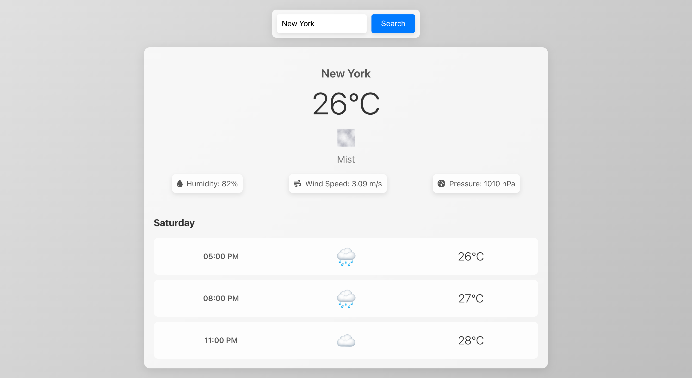

# 🌤️ Weather App

A modern weather application designed with an Apple-like aesthetic, built using React and TypeScript. This app fetches and displays current weather conditions and a 5-day forecast for the user's location or a searched location.



## 📖 Table of Contents

1. **[🚀 Features](#-features)**
2. **[🛠️ Technologies Used](#️-technologies-used)**
3. **[⚙️ Installation](#️-installation)**
4. **[📚 Usage](#-usage)**
5. **[🔧 Configuration](#-configuration)**
6. **[📜 License](#-license)**

## 🚀 Features

- **🌡️ Current Weather**: Displays the current temperature, weather condition, and location.
- **📅 5-Day Forecast**: Shows the weather forecast for the next 5 days in 3-hour intervals.
- **🎨 Dynamic Background**: Changes the background gradient based on the current weather condition.
- **📍 Geolocation**: Automatically fetches weather data for the user's current location.
- **🔍 Search Functionality**: Allows users to search for weather data by entering a location.

## 🛠️ Technologies Used

- **React**: JavaScript library for building user interfaces.
- **TypeScript**: Typed superset of JavaScript that adds static types.
- **OpenWeatherMap API**: Provides weather data for current conditions and forecasts.

## ⚙️ Installation

1. **Clone the repository:**
    ```sh
    git clone https://github.com/yourusername/weather-app.git
    ```
2. **Navigate to the project directory:**
    ```sh
    cd weather-app
    ```
3. **Install dependencies:**
    ```sh
    npm install
    ```

## 📚 Usage

1. **Start the development server:**
    ```sh
    npm start
    ```
2. **Open your browser and go to `http://localhost:3000` to view the app.**

## 🔧 Configuration

- Replace `YOUR_API_KEY_HERE` in `App.tsx` with your own OpenWeatherMap API key.

## 📜 License

This project is licensed under the MIT License. See the [LICENSE](LICENSE) file for more details.
